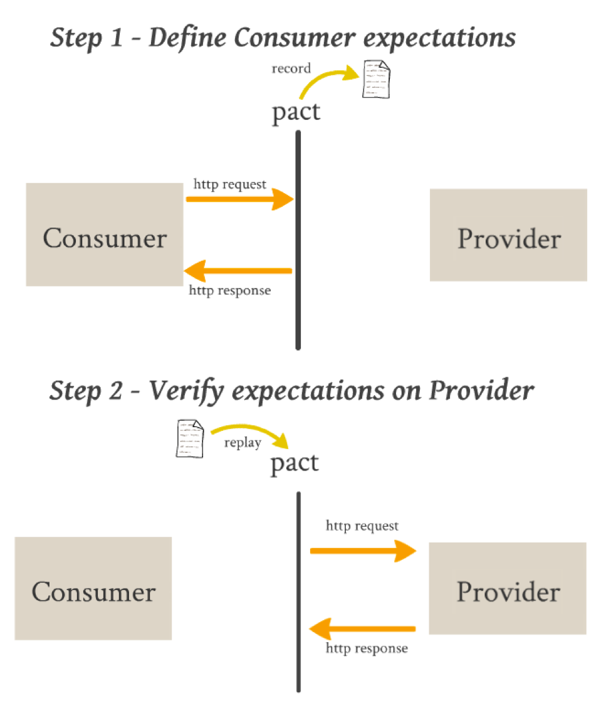
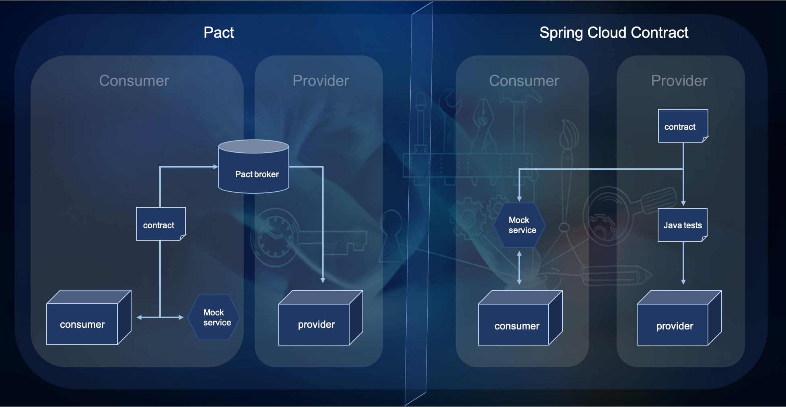

# 组件测试

组件开发模式下，由于单体软件被拆分未多个组件独立交付，那就不得不定义组件的交付标
准。由于`涌现`特性，各个组件并不具有整体系统产品的特征，传统的手工测试由于需要测试人
员的额外的组件知识学习成本，导致并不适用于组件测试的验收和质量保证活动。因此我们
谈组件测试，更多的讲如何做好开发人员的自动化测试。由于组件需要通过交互的方式来协
作提供整体特性，必然存在与其他组件交互的接口测试。而除了接口层面的测试外，为了提
高测试效率，可以对内部的逻辑单元采用单元测试的方式，来正交化部分测试场景。本节主
要从接口测试和单元测试的角度来分析如何做好组件测试。

## 接口测试

### 集成测试
探讨接口测试就不得不提到集成测试，集成测试就是把互相有接口调用关系的几个组件放在
一起做连通性测试，关注接口的相互调用是否符合预期。集成测试作为在传统测试金字塔中的重要环节，是系
统测试之前的重要活动，成本相对系统测试低，但比单元测试高。

#### 自动化中集成测试的困境
自动化测试的概念于今日已然不是新鲜词汇，在整个测试金子塔中的各层都有广泛的推广。
随着自动化测试的推广，
* 单元测试：有相对成熟的xunit框架，由开发人员开发和守护；
* 系统测试：作为质量的最后一关，是最容易让项目直观看到收益，而投入资源和经理去
开发和维护的。
* 集成测试: 尴尬从3个方面体现：
  * 从变化的角度，集成的组件之间还属于内部接口，而接口的变化会导致测试用例的维护成本显著上升；
  * 从守护的角度，集成测试一般跨越2个开发团队，集成测试的守护职责难免存在推诿的情
  况。
  * 从溯源的角度，集成测试过程中经常出现问题后，还需要花较多的精力去排查是否是组件
  内部出的问题。

综合看来，集成测试自动化的难点在于如何真正关注把集成做薄，尽可能的将原本应该
组件各自做好的事情提前做好。“契约测试”可能是时下致力于这个方向努力的最佳实践。

### 契约测试

契约测试的概念诞生于Martin Fowler 网站上06年的[一篇文
章](https://martinfowler.com/articles/consumerDrivenContracts.html)
它又被称之为：消费者驱动的契约测试（Consumer Driven Contracts）。文中介绍主要应
用于服务的提供商和消费端之间的数据交互格式，后来Martin
Fowler又在2011年的专门写了一篇关于[契约测试
](https://martinfowler.com/bliki/ContractTest.html) 的文章。 这篇文章谈到了契约测试和
`test double`的差别。最初这种测试技术更多的用于前后端分离后的契约保证，但在微服
务大行其道的今天，这种思想开始更多应用于服务间接口自动化测试的领域，
比较有名框架有[PACT](https://docs.pact.io/) 和[Spring Cloud Contract](https://spring.io/projects/spring-cloud-contract)，下面我们一起看一下契约测试的实现

#### PACT
Pact是一个开源框架，最早是由澳洲最大的房地产信息提供商REA Group的开发者及咨询师
们共同创造。REA Group的开发团队很早便在项目中使用了微服务架构，并在团队中对于
敏捷和测试的重要性早已形成共识，因此设计出这样的优秀框架并应用于日常工作中也是十分自然。
Pact工具于2013年开始开源，发展到今天已然形成了一个小的生态圈，包括各种语言
（Ruby/Java/.NET/JavaScript/Go/Scala/Groovy...）下的Pact实现，契约文件共享
工具Pact Broker等。Pact的用户已经遍及包括RedHat、IBM、Accenture等在内的若干
知名公司，Pact已经是事实上的契约测试方面的业界标准。

PACT的大致过程：



#### Spring Cloud Contract
Spring Cloud提供了Spring Cloud Contract框架来支持契约测试。其基本思路和PACT的并
不完全一致，其大致过程为：

* 服务提供者
 1. 编写合同规范Contract(Groovy DSL）
 2. 在Provider端使用Contract生成自动验收测试
 3. 生成WireMock JSON存根＆将存根发布到Maven（本地）存储库

* 服务消费者
 1. 在消费者端配置Stub Runner
 2. 执行消费者测试 - Stub Runner嵌入了WireMock
 3. 检查验证结果
 
#### 对比
关于两者的差别, [契约测试之核心解惑](https://www.jianshu.com/p/ca82cde5b125) 
一文解释的非常到位，下图也引用自文章中。PACT是真正践行“契约测试”中提到的 CDCT（Consumer Driven Contracts），Spring Cloud
Contract更多的应该被称为“基于契约的测试”。



#### 契约测试替代集成测试？
虽然我们说契约测试在努力的让集成测试变得更好，但并非取而代之，究其本源两者的关注
点并非一致，契约测试更关注两个组件或服务之间的一致性。而集成的概念要更广泛，也更
抽象，当组件数量较多时，有时甚至需要几个组件分批次的集成，才能有效的降低系统测试
的风险，


#### 什么才是好的契约测试框架

结合时下流行的两大契约测试框架以及一些经验的诉求，我们希望的好的契约测试框架应该具备哪些特征：
* 自动生成: 接口一旦定义好，可以自动生成用例，接口发生变化时，可以触发相应用例变
  化，感知到接口变化的影响。
* 分布式：接口的提供方和消费方，都能拿到各自需要满足的用例，分别开发和守护。

#### 嵌入式系统的契约测试
相对于互联网金融等业务形态，微服务的交互更多依赖REST接口，REST本身就是文本形式，
服务之间的解耦性是比较容易，替换成本也是比较低的。那么如果在嵌入式领域，当接口的
形态变化时，该如何录制，又怎么去回放将会是一个值得研究的课题。
* 插件，主进程内或多线程，函数调用？
* 进程，进程间接口，管道，共享内存等。

目前在开源的社区还没看到比较流行的嵌入式契约测试框架。

抛开框架的能力之外，想要享受契约测试带来的好处，至少需要有个标准化的契约描述方式，
基于标准化的描述，才有可能达到自动化的一些目标，在PACT中是pact文件，而SCC中是
Groovy的DSL，这些要么在社区或语言文化内形成了事实标准。如何设计出优秀的具备语义
说明而又方便自动化的API描述DSL，可能是首要挑战。

##### 契约描述

####### PACT 的契约描述

```json
{
  "consumer": {
    "name": "TodoApp"
  },
  "provider": {
    "name": "TodoService"
  },
  "interactions": [
    {
      "description": "a request for get user",
      "providerState": "have a matched user",
      "request": {
        "method": "GET",
        "path": "/1"
      },
      "response": {
        "status": 200,
        "headers": {
          "Content-Type": "application/json; charset=utf-8"
        },
        "body": {
          "id": 1,
          "name": "God"
        }
      }
    }
  ],
  "metadata": {
    "pactSpecification": {
      "version": "0.0.0"
    }
  }
}

```

###### Sprint Cloud Contract
有两种形式yaml和groovy，表达力上近似，基本上看到的例子都是基于rest接口做的描述

``` yaml
request:
  method: GET
  url: /foo
  bodyFromFile: request.json
response:
  status: 200
  bodyFromFile: response.json
```

我们看到现存的两种契约描述方式上还是属于具像化的描述方式，有点像一个个用例一样，
但用例十分完备，到底抽象的几口形式是如何的？接口的文档又是通过其他的如swagger来
生成的，接口和契约不应该是同源的吗？

对于理想契约文件，应该选择一种相对中立的描述语言，因为基于契约要自动生成接口文档和
测试套件，考虑工具的易用性设计和可读性，选择通用的yaml，json，protobuff等的形式来作为外部DSL，
更具有可操作性。但不建议直接使用组件间数据交互的格式，具体的通信格式是实现细节，
直接依赖会导致后续变化的不稳定。

契约文件中必须的结构：
1. 数据的结构
2. 数据的字段的约束
3. 字段的描述

生成接口文件，以及注释，需要1，2，3
生成接口文档，需要1，2，3
生成测试数据，需要1，2

其中字段约束这部分还是缺失的，我们拿json举例
``` json
 
 "consumer": {
    "name": "TodoApp"
    "id": "11" //这里是用户的唯一标示，@int(1,30)
  },
  "provider": {
    "name": "TodoService"
  },
```
上述id这个字段有注释的部分说明它的用途，而在后面取值范围（1，30）是生成测试用例
的关键数据，具体的设计还需要一个完善的过程，这里并不展开。


##### 契约管理
契约文件作为组件之间的接口定义，常规也是会被版本管理起来的，但契约文件又有它但特
殊性，比如放在消费者那里？还是放在提供者那里？如何感知到契约发生了变化，进而触发
相应的用例代码生成和测试执行？这些都暗示应该单独管理契约文件，PACT中的提供了这样
的一套管理框架，Pact Broker是契约的管理者(代理人)。它提供了：

* 发布和获取契约的接口
* 服务之间的依赖关系
* 契约的版本管理

且不论是否需要单独的管理软件来管理契约文件，单独将契约隔离出进行版本管理是十分有
必要的，会有利于基于契约变化引起的变更管理。


## 单元测试


## 参考资料

[聊一聊契约测试](https://insights.thoughtworks.cn/about-contract-test/)

[消费者驱动的契约测试 Spring Cloud Contract介绍](https://blog.csdn.net/peterwanghao/article/details/86293430)

[契约测试之核心解惑](https://www.jianshu.com/p/ca82cde5b125)
