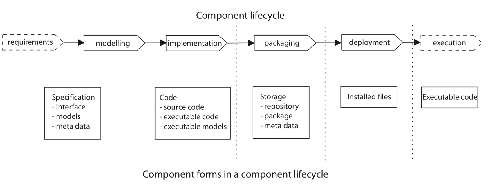
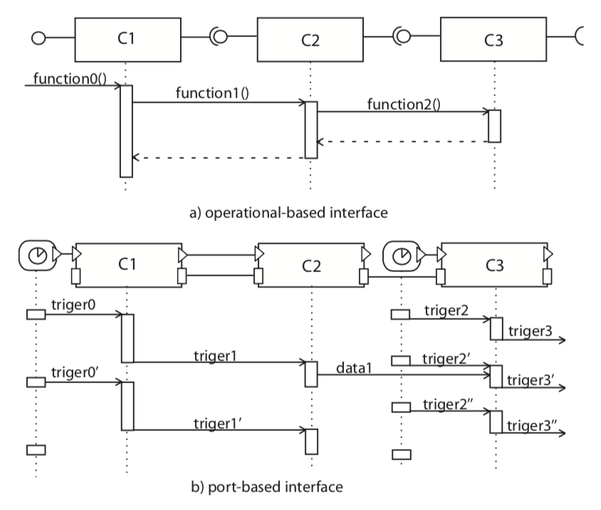
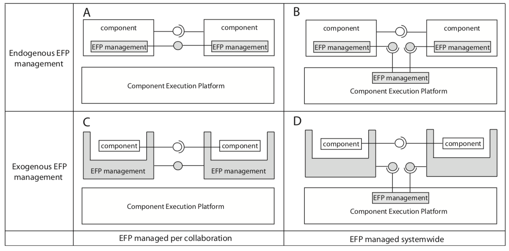

# 组件化架构定义

整理自论文[《A Classification Framework for Software Component Models》](../outline/tse_classificationFramework.pdf)

---

过去几十年，大量不同的软件组件模型（software component models）被开发出来，这些组件模型分别使用不同的原则和技术，针对不同的目标。这些模型有很多相似性，但是又有各种不同，甚至有些之间概念含混不清。基于组件的开发并没有如“面向对象”那样在提供标准原则上获得成功。为了能够理解组件的各种概念，更容易区分各种组件模型，本文区分和讨论组件模型的基本特点和原则，并基于这些原则提供一个组件模型分类框架。进一步，本文使用该分类框架对大量的组件模型进行分类。

COMPONENT-BASED software engineering (CBSE) 的构成从面向对象、软件架构、中间件以及结构化和模块化开发演进而来。

软件中组件一次并不如它在硬件中那么清晰，人们在软件中关于组件一词有很多的争论。

-  “A software component is a unit of composition with contractually specified interfaces and explicit context dependencies only. A software component can be deployed independently and is subject to composition by third party.” - C. Szyperski, Component Software: Beyond Object-Oriented Programming. Addison-Wesley Professional, December 1997.

- “A software component is a software element that conforms to a component model and can be independently deployed and composed without modification according to a composition standard.” - G. T. Heineman and W. T. Councill, Component-Based Software Engineering: Putting the Pieces Together. Addison-Wesley Longman Publishing Co., 2001.

Heineman and Councill定义了component model： “A component model defines a set of standards for component implementation, naming, interoperability, customization, composition, evolution and deployment”.

这个组件模型指出了组件开发过程的两个重要方面：1）开发独立组件需要的原则；2）将多个组件集成成系统所遵循的原则；

组件模型受其目标系统特定的约束（实时性、安全性、以及资源占用等）。组件模型为了支撑系统特性的达成，需要遵循一定的规则。CBSE被应用于大量的应用领域，每个领域都有自己的体系结构需求，这一事实解释了为什么今天存在许多组件模型。这种多样性增加了理解组件模型的共同原则的难度。

## Component Model

Definition: A Component model defines standards 
- (i) properties that individual components must satisfy；
- (ii) methods for composing components.

A component-based system identifies：
- (i) components
- (ii) an underlying platform
- (iii) the binding mecha- nisms

CBS =< P,C,B >，Where：
- CBS = Component-based system; 
- P = System platform;
- C = A set of components Ci;
- B = Set of bindings Bi.

设计和组合组件，指定原则，隐藏组件的实现复杂性。
组件模型很大的影响了组件开发和运行的复杂度。

### Components - C

- 组件要能够执行，组件区别于其他可执行程序的区别在于，组件要能够和其它组件以预定义好的规则通讯。
- 组件需要有一组属性描述，用于区分和分类组件。属性包含功能性和非功能性。
    C = <I, P>, with I = {i1, i2, ...}, P = {p1, p2, ...}
    - I: 接口，定义了组件需要提供的功能属性
    - P: 定义了组件需要提供的非功能属性
    - 如果一个组件和一个组件模型集成，那么组件属性遵从于组件模型：C |= C M ⇒ I , P |= C M

### Bindings - B

Bindings定义了接口之间的连接。Binding分为：
1）组件和平台之间的，使得组件可以集成进系统；这里我们称之为“组件部署”（Component Deployment）；
2）组件与组件之间的，使得组件之间可以交互；这里我们称之为“组件绑定”（Component Binding）；

### 组合组件

组件C1和C2通过它们的接口I1、I2绑定在一起，这就构成了一个装配（Assembly）A= {C1, C2}。
如果组件模型里将Assembly作为架构元素，则Assembly通过它的接口Ia指定：A={C1,C2},A=⟨IA⟩|IA =⟨I1 ⊕I2⟩；
Assembly没有必要得是一个组件。组件模型也不一定需要由Assembly构成。

如果Assembly C = {C1, C2}构成了组件模型：
C = ⟨ I , P ⟩ ; I = ⟨ I 1 ⊕ I 2 ⟩ , C |= C M，
这时Assembly是一个组件，叫做组合组件（composite component）。

组合组件展示出一系列非功能特性。当C = {C1, C2}，C的非功能特性并非是p1和p2的并集，这取决于整个外部环境（external environment）。
C=⟨C1⊕C2⟩⇒I=⟨I1⊕I2⟩∧Pex⊢P=⟨P1⊕P2⟩
Pex表示外部上下文对于组合组件的非功能特性施加的影响。

## 组件模型分类框架

### lifecycle

不同阶段组件的转换形式和载体。CDL：组件描述语言。

### construction

- interfaces：接口

两种类型，基于操作（Operationnal-based）和基于端口（port-based）。

provide interface | require interface

接口未必需要是组件的一部分。

接口在组件生命周期不同阶段的形式不同。如从模型图到代码；代码形式的接口有两种类型：1）IDL（interface description language），2）编程语言接口：类接口，头文件...

为了能够独立部署或者动态重配组件，一些组件模型会定义标准的二进制兼容接口。

为了做接口的兼容性检查，接口有三个层面的兼容性级别：
    - 语法级别：接口原型，主要靠代码静态或者动态检查兼容性；
    - 功能语义级别：除了接口原型外，还要遵循前置和后置条件的契约；
    - 行为级别：接口的内部执行逻辑满足一定的顺序要求，可能通过状态图或者有限状态机表达行为逻辑；

组件在演进过程中，可能同时存在多个版本的接口；

- binding mechanisms

用于建立组件间的连接，将组件组合起来。组件组合起来后对外呈现的功能和非功能属性，和单独两个组件的映射是复杂的。
两种组合模型：
    - 水平组合：
    - 垂直组合：

两种binding模式：
    - exogenous composition：外部组合
    可以使用独立的connector组件用于连接组件：1）是的组件连接显示化；2）组件连接对于组件做到透明；
    connector在很多组件模型中都是一个独立组件，采用某种实现模式，例如：adaptor、proxy或者broker模式。
    connector可以用于实现复杂的多种方式的组件交互模式；
    - endogenous composition：内部组合
    每个组件自行实现交互和通讯的协议；

外部依赖的决定：
    - 组件自行决定：一般通过反射接口，组件自行查找组件需要连接的接口；或者一个注册中心，用于查找对应功能的组件；
    - 第三方决定：组件的依赖由外部注入；

当在部署时进行组件绑定的话，经常需要一个docking接口（进港接口）。docking接口并不提供任何的业务功能，只是服务于组件和下层运行时架构的绑定以及随后的交互。很多组件模型中，绑定机制是位置透明的，组件可以部署到本地或者远端节点上。

- interactions

patterns：
    - C/S client-server，点对点
    - 异步、同步
    - pipe&filter，消息队列，适合事件流，组件间间接通讯。控制和数据分流。
    - 广播broadcast、黑板blackboard、发布于订阅

交互模式决定了组件间的依赖方式。
大量的强依赖关系导致需要复杂的绑定协议和机制，才能使得组件被独立替换。

    - passive component：依赖于外部激励才能执行，例如事件驱动
    - active component：自行运行，可以基于独立线程执行

### Extra-functional properties （EFPs）

目的：
- 非功能特性，例如组件的最大部署或者单接口执行时延，可以帮助系统确认组件是否破坏系统的约束。
- 另外，通过管理机制，例如通过组件冗余提高系统的可靠性。
- 从组件框架以及集成的组件的非功能特性，对整系统的非功能特性进行预测；

#### EFP分解

EFP描述： ⟨Attribute, Value, Credibility⟩

Attribute =  ⟨TypeID, Value+⟩
Value = ⟨Data, Metadata, ValidityCondition∗⟩
where:
• TypeID defines the extra-functional property;
• Data contains the concrete value for the property;
• Metadata provides complementary information on data that allows to distinguish the values; and
• ValidityConditions describe the conditions which need to be satisfied to keep the value valid upon reuse.

#### 管理 EFPs

组件模型有几种管理EFPs的模式：
- Exogenous Management：管理机制外置于组件.
- Endogenous Management： 管理机制在组件内实现，组件开发者负责实现它；
- Management per Collaboration：管理机制与组件直接进行交互.
- Systemwide Management：管理机制由组件框架或者底层中间件提供.

通过组合上述集中方式，我们得到四种可能的提供EFP的方式：
- Approach A (endogenous per collaboration)：组件模型不提供任何对EFP管理的支持，组件开发人员自行实现它。这样每个组件可以针对特定系统进行EFP策略的优化，并能够在系统中使用多种EFP策略。不过整系统的EFP预测将变得困难；
- Approach B (endogenous systemwide)：组件运行平台包含EFPs管理机制，每个组件中也有。组件的EFP管理需要能够感知组件平台的管理机制如何影响，协商EFP处理方式的能力要求组件本身对EFP如何影响其功能有一定的了解。
- Approach C (exogenous per collaboration)：组件外包围container，由container负责EFP管理。container和组件分离关注点；组件变得通用和容易实现，但是潜在系统性能可能会下降。
- Approach D (exogenous system-wide)：和C类似，差别在于系统可以进行全局的协调，例如全局的load-balance。组件的执行平台会变得更加复杂。

#### 组合EFPs

组合EFPs是复杂的，最后的EFPs和组件自身、系统架构以及上下文和外部条件都有关系。可以分为以下类：
- Directly composable properties： 例如静态内存，只和组合的组件有关；
- Architecture-related properties：不仅和组件相关，还和系统架构相关；例如性能，和组件以及架构的并发度都有关；
- Emerging properties：和架构以及组件的多个属性维度有关；例如响应时间，和组件的执行时间，组件的资源利用情况，以及架构都有关；
- Usage-depended properties：例如可靠性，随着系统的资源利用率在变化；
- System environment context properties：例如security and safety，和系统的外部上下文相关；
- Non-composable properties：非可组合的EFP属性，例如可维护性、可移植性等等；

#### EFPs属性分类总结

三个方面：
- EFP管理：组件模型提供那种的管理类型？
- EFP规范：组件模式是否包含特定EFPs的规范？如果有的话，由哪些属性组成？
- EFP组合：组件模型是否提供方式、方法以及技术用于EFP的组合，以及哪种组合方式？

### 组件模型分类总览图

## 组件模型调查

下面24个组件模型，后面基于前文的分类框架对其进行总结和分类：

• AUTOSAR (AUTomotive Open System ARchitec- ture) [38],
• BIP (Behaviour, Interaction, Priority) [31],
• BlueArX [39],
• CCM (CORBA Component Model) [22],
• COMDES II (COMponent-based design of software for Distributed Embedded Systems, version II) [40],
• CompoNETS [41],
• EJB (Entreprise JavaBeans) [21],
• Fractal [30],
• Koala [17],
• KobrA (KOmponentenBasieRte Anwendungsen- twicklung) [19],
• IEC 61131 [28],
• IEC 61499 [42],
• JB (Java Beans) [25],
• MS COM (Microsoft Component Object Model) [23],
• OpenCOM [43],
• OSGi (Open Services Gateway Initiative) [26],
• Palladio Component Model [18],
• Pecos (PErvasive COmponent Systems) [44],
• Pin [20],
• ProCom (PROGRESS Component Model) [14],
• Robocop (Robust Open Component Based Software Architecture for Configurable Devices Project ) [15] [45],
• Rubus [29],
• SaveCCM (SAVE Components Component Model) [13]
• SOFA (Software Appliances) [46].

具体的分类情况，以及每个组件模型的介绍，参见论文正文。

