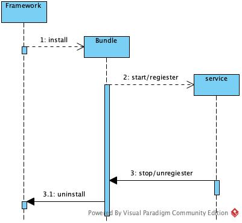
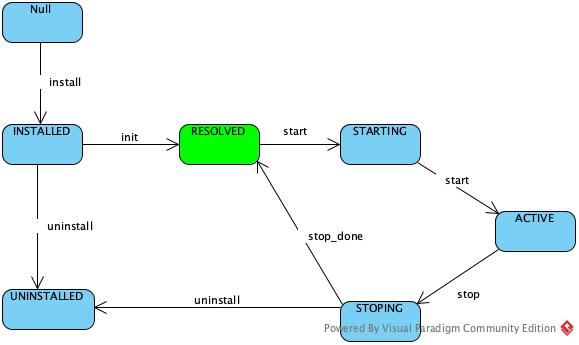

# 组件化架构平台

```
## 是否可以统一静态组件，动态组件，进程组件，服务组件的接口，按需发布
可能需要一套DSL解析，配合动态生成代码技术。同时平台需要提供管道能力，管道能力也
考虑使用插件方式支持。

## 插件之间的依赖关系如何管理，运行时被依赖插件的可见性如何管理？

## 如何设计插件间通信机制
对于跨进程通信的，要考虑通信机制的选择
### 点到点通信
通过注册中心，拿到自己依赖的组件信息，通过平台提供的通信模块，之间交互
### 消息中心订阅发布 
之间把发送目标组件信息，和内容，发给消息中心，由消息中心路由。


## 插件声明周期管理
### 插件安装，卸载，查询

##  契约测试框架
```

## Learn CppMicroServices
CppMicroServices 是一个实现OSGI标准的框架，提供插件注册和插件生命周期管理的能力。
CppMicroServices 使用cmake来做构建，关键的领域模型Bundle，Framework， Service，
BundleContext，等详细关系见下图

    
### 框架使用
必须在cmake中定义`US_BUNDLE_NAME`，并使用框架预定义好的cmake函数统一目录，打包等。
```
usFunctionAddResources(TARGET target [BUNDLE_NAME bundle_name]
  [WORKING_DIRECTORY dir] [COMPRESSION_LEVEL level]
  [FILES res1...] [ZIP_ARCHIVES archive1...])
```

还需要定义`manifest`，内入如下：
```
{
  "bundle.symbolic_name" : "eventlistener",
  "bundle.activator" : true
}
```
代码中需要继承`BundleActivator`，并使用宏
`CPPMICROSERVICES_EXPORT_BUNDLE_ACTIVATOR`来生成标准化的创建和销毁函数
然后实现start和stop接口，在start和stop接口函数中，可以通过BundleContext可以获取其他的服务,也在可以把自己
的服务注册给BundleContext，供其他服务使用，接口可见需要增加`US_ABI_EXPORT `修饰 interface。 
``` 
CPPMICROSERVICES_EXPORT_BUNDLE_ACTIVATOR(EnglishDictionary::Activator)
```
这个宏里用会到`US_BUNDLE_NAME`来生成创建函数和销毁函数。服务接口类可以注册多个，相
同服务接口类可以通过`ServiceProperties`来进行区分，在调用接口时，可以通过LDAP规则，
进行相同服务接口的过滤。


## 框架实现原理
Bundle作为插件（服务）的封装容器，最终提供动态库供Framework加载， framework使用
dlopen打开文件加载符号（linux类系统）。生命周期管理与动作的管理见下图：



Bundle之间充分结偶，但需要看到所调用但接口但头文件，框架中设计了Linsener机制来结
偶服务提供和服务状态获取，Service,Bundle,Framework都有Linsener机制，Bundle可以添加到CoreContext，以获
取所依赖服务的情况，以保证对依赖接口的有效安全使用。

框架也可以添加HOOK，hook可以作为补丁来使用替代原有的插件，或增强原有插件。

bundle像一个容器，bundleContext 只是一个代理，具体委托到BundlePrivate 和
CoreBundleContex上。安装以bundle为单位，bundle在activoer里注册自己的Service

符合可见性管理 US_ABI_EXPORT 用来导出Service的API
```
#if defined(US_PLATFORM_WINDOWS)
  #define US_ABI_EXPORT __declspec(dllexport)
  #define US_ABI_IMPORT __declspec(dllimport)
  #define US_ABI_LOCAL
#elif defined(US_HAVE_VISIBILITY_ATTRIBUTE)
  #define US_ABI_EXPORT __attribute__ ((visibility ("default")))
  #define US_ABI_IMPORT __attribute__ ((visibility ("default")))
  #define US_ABI_LOCAL  __attribute__ ((visibility ("hidden")))
#else
  #define US_ABI_EXPORT
  #define US_ABI_IMPORT
  #define US_ABI_LOCAL
#endif
```

## 生命周期管理
### Service的生命周期
在BundleActivor中在start，stop时机，通过Context注册和停止service的，此时在线程
中，可注册多个服务接口，生命周期自己控制，随Bundle被销毁。
### Bundle的生命周期
由框架调用install, uninstall管理Bundle，install后由里bundle的对象，但start后才有BundleThread。
有版本号通过BundleVersion来管理，提供基本的4位版本号定义，但未使用在版本升级上。
### Framework的生命周期
全局生命周期，绑定coreBundleContext，一旦销毁，所有注册Bundle的生命周期都结束。


BundleState的状态图如下：




## 设计上的一些问题

* BundleContext 提供的API里包含代理的CoreBundleContext的，getBundles这类接口，和自
己的GetBundle在一起比较容易引起误解。

* 并没有设计bundleContext的分层隔离，全部的Service，Linsener等都注册在
  coreBundleContext上。分发范围和过滤范围都比较大。

* 框架没有集成包管理和依赖管理工具，整体设计是微服务框架，依赖管理上只设计了动态调
用的接口找不到的状态跟踪机制，未考虑静态包依赖的问题解决。

* 类方法的可见行管理上并不十分严谨，

* 接口方面的设计感觉还不是很完善，如何发布接口？，接口和包分开发布？接口设计与契
  约测试等还没看到。

## 设计上觉得比较好的地方

* 注释非常详细，使用Doxygen的注释规范，方便生成文档。
* 使用LDPA进行过滤，有一套完善的语法
* 是不是可以考虑使用Framework来进行分层隔离
* 框架在职责结偶方面设计的比较干净，

## 一些其他编程约束
singletons 在Bundle中的限制使用，单例导致的释放顺序问题超出了框架的管理范围。由
于Bundle的方法都在线程中调用，singletons需要考虑多线程都问题。


