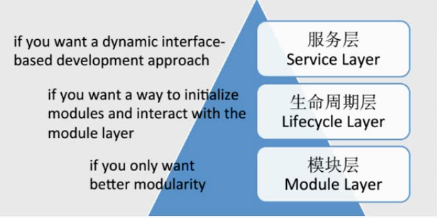

# OSGi

## OSGi基础

## Class Loader

- In web container such as Tomcat
- In Andriod

## OSGi组成

### 分层

### 模块层 ：关注打包和代码共享。

OSGi 是严格要求模块化的，模块有个专有名词 bundle。每个模块都是一个 bundle，一个 Business Logic 由多个 bundle 来实现。

注：后面全部使用 bundle 代替模块来表述。

模块层定义了 OSGi 中的模块 bundle：

- bundle 是以 jar 包形式存在的个模块化物理单元，里面包含了代码，资源文件和元数据(metadata)，井且 jar 包的物理边界也同时是运行时逻辑模块的封装边界。

- bundle 是开发、部署 OSGi 应用的基本单元。

- bundle 的核心是 META-NF 目录下的 MANIFEST.MF 文件。

- bundle 定义了其所包含的包的可见性、可以认为是在 public/private/protected 的基础上的一个扩展。

- bundle 的 java 包共享、屏蔽的规则。通过 Export-Package、Import-Package 方式进行交互。

- 每个 bundle 都有单独的类加加载器。

### 生命周期层 ：关注提供执行模块管理和对底层 OSGi 框架的访问。

bundle 是需要 OSGi 进行解析的，每个 bundle 在变得可用之前，都需要完整经历该生命周期。

OSGi 生命周期层有两种不同的作用:

- 在应用程序外部，定义了对 bundle 生命周期的相关操作。OSGi 生命周期层允许在执行时，从外部安装、启动、更新、停止、卸载不同的 bundle 进而定制应用的配置。

- 在应用程序内部，定义了 bundle 访问其执行上下文的方式，为 bundle 提供了一种与 OSGi 框架交互的途径以及一些执行时的便利条件。

### 服务层 ：关注模块，特别是模块内的组件的交互和通讯。

OSGi 技术全面贯彻了 SOA，每个 bundle 都是其他 bundle 提供服务，夸张一点说，不提供服务的 bundle 就没有存在的价值。

OSGi 的服务层除了面向服务的编程模型，还有一个区别于其他很多类似模型的特性。也就是说，当一个 bundle 发现并开始使用 OSGi 中的一个服务了以后，这个服务可能在任何的时候改变或者是消失。

OSGi 框架有一个中心化的注册表，这个注册表从 publish-find-bind 模型:

OSGi 核心规范(core specification)中的服务，为核心服务，必须存在的。

### 参考

- https://www.cnblogs.com/binarylei/p/8525388.html

## OSGi Framework

- Equinox：OSGi R4 core framework 的一个实现，一组实现各种可选的 OSGi bundle 和一些开发基于 OSGi 技术的系统所需要的基础构件。 Eclipse 是基于 Equinox 项目开发的一个典型例子。具体内容可以从 http://www.eclipse.org/equinox/ 下载。比较适合不需要集成太多外部技术的应用，如桌面应用开发，当需要进行集成时，会遇到相当多的兼容性问题;

- Apache Felix：实现 OSGi R4 规范(包括 OSGi 框架，Standard Service 和其它 OSGi 相关技术)的另一个开源项目。具体内容可以从 http://felix.apache.org/ 下载。与 Equinox 非常相似，都属于基础环境。但也有一个最大的不同，其兼容性、可扩展性都比较强，能够很方便的集成 Web Container、DataSource 管理等许多实际开发中必须具备的组件。但是这里有个很大的隐患：所有的集成都需要手工完成，质量、测试都无法保证，作为系统最重要的基础运行环境，其稳定性、可靠性是至关重要的。

- Apache Karaf：一个基于 OSGi 的运行环境，它提供了一个轻量级的 OSGi 容器，可以用于部署各种组件和应用程序。它提供了很多的组件和功能用于帮助开发人员更加灵活的部署应用，更适合作为商业化产品的开发、运行平台。具体内容可以从 http://karaf.apache.org/ 下载。

## JAVA 9 Module && OSGi

Java 9，OSGi和模块化的未来

- https://mindawei.github.io/2018/02/05/Java-9%EF%BC%8COSGi%E5%92%8C%E6%A8%A1%E5%9D%97%E5%8C%96%E7%9A%84%E6%9C%AA%E6%9D%A5%EF%BC%881%EF%BC%89/

- https://mindawei.github.io/2018/02/06/Java-9%EF%BC%8COSGi%E5%92%8C%E6%A8%A1%E5%9D%97%E5%8C%96%E7%9A%84%E6%9C%AA%E6%9D%A5%EF%BC%882%EF%BC%89/